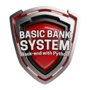
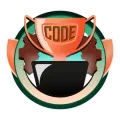
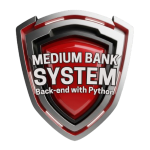
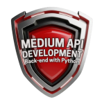
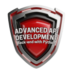

# Santander Bootcamp 2025 – Back-End with Python

<h2> Basic Bank System </h2>

Lorem ipsum dolor sit amet, consectetur adipiscing elit, sed do eiusmod tempor incididunt ut labore et dolore magna aliqua. Ut enim ad minim veniam, quis nostrud exercitation ullamco laboris nisi ut aliquip ex ea commodo consequat.

<h2> Code Challanges 00 </h2>
<table><tr><th>Exploring Operators and String Manipulation</th></tr><tr><td>

| Online Discount | E-mail checker |
| :-: | :-: |
|  |  |

</tr></td></tr></table>

<h2> Code Challanges 01 </h2>
<table><tr><th>Applying Datas and List</th></tr><tr><td>

| Shopping Cart | Event Organizer |
| :-: | :-: |
|  |  |

</tr></td></tr></table>

<h2> Improving Basic Bank System with functions </h2>

Lorem ipsum dolor sit amet, consectetur adipiscing elit, sed do eiusmod tempor incididunt ut labore et dolore magna aliqua. Ut enim ad minim veniam, quis nostrud exercitation ullamco laboris nisi ut aliquip ex ea commodo consequat.

<h2> Code Challanges 02 </h2>
<table><tr><th>Working with functions</th></tr><tr><td>

| Medical Triage System | Hotel Reservation System |
| :-: | :-: |
|  |  |

</tr></td></tr></table>

<h2> Medium Bank System </h2>

Lorem ipsum dolor sit amet, consectetur adipiscing elit, sed do eiusmod tempor incididunt ut labore et dolore magna aliqua. Ut enim ad minim veniam, quis nostrud exercitation ullamco laboris nisi ut aliquip ex ea commodo consequat.

<h2> Code Challanges 03 </h2>
<table><tr><th>Working with functions</th></tr><tr><td>

| Vehicle Manager System | Restaurant Order System |
| :-: | :-: |
|  |  |

</tr></td></tr></table>

<h2> Code Challanges 04 </h2>
<table><tr><th>Working with Python Packeges</th></tr><tr><td>

| Access Control System | Stock Control System |
| :-: | :-: |
|  |  |

</tr></td></tr></table>

<h2> Advanced Bank System </h2>

Lorem ipsum dolor sit amet, consectetur adipiscing elit, sed do eiusmod tempor incididunt ut labore et dolore magna aliqua. Ut enim ad minim veniam, quis nostrud exercitation ullamco laboris nisi ut aliquip ex ea commodo consequat.

<h2> Medium API Development </h2>

Lorem ipsum dolor sit amet, consectetur adipiscing elit, sed do eiusmod tempor incididunt ut labore et dolore magna aliqua. Ut enim ad minim veniam, quis nostrud exercitation ullamco laboris nisi ut aliquip ex ea commodo consequat.

<h2> Advanced API Development </h2>

Lorem ipsum dolor sit amet, consectetur adipiscing elit, sed do eiusmod tempor incididunt ut labore et dolore magna aliqua. Ut enim ad minim veniam, quis nostrud exercitation ullamco laboris nisi ut aliquip ex ea commodo consequat.

